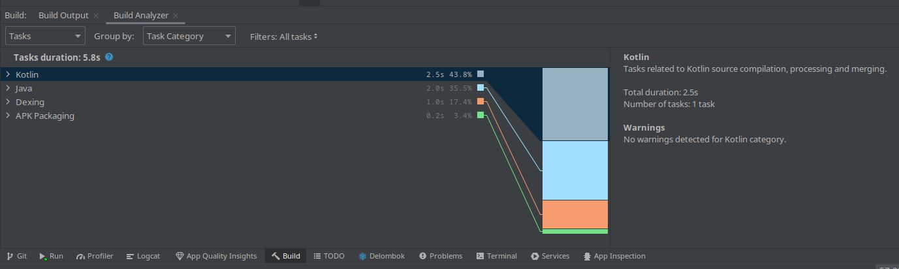

As you see Juggluco consist according to Github for 1.2% out of Kotlin and according to Android Studio Build Analyzer tasks related to 
Kotlin took 43.8% of the time to make the Debug version of Juggluco.
# Juggluco
An Android app that displays glucose values it receives via Bluetooth from Freestyle Libre 2 and 3 sensors.

Abbott's Freestyle Libre 2 sensors transmit every minute the perceived glucose value to the connected reader or smartphone. Abbott's Librelink app uses this value only for low and high glucose alarms. Juggluco displays this value on the smartphone in addition to low and high glucose alarms. So you can know your current glucose value without scanning.  
Newer versions of Juggluco can also be used with Freestyle Libre 3 sensors, but all further remarks relate to Libre 2. See https://www.juggluco.nl/libre3 for more information about the use of Libre 3.  
Juggluco can only take over the Bluetooth connection of a sensor that is already in use, when ALL COMPETING CONNECTIONS WITH THE SENSOR ARE REMOVED by FORCE CLOSING the Libre app and turning off Freestyle reader or turning off alarms of these apps and devices. Hereafter you scan the sensor a few times with your smartphone while Juggluco is in the foreground and, when everything goes well, within 20 minutes or less Juggluco will establish a connection with the sensor and start receiving glucose values via Bluetooth.  
After using a sensor with Juggluco, you can still scan the sensor with Librelink or Freestyle Reader, but their alarms will never work again (Patched versions of the Libre 2 or Librelink app can take over the Bluetooth connection when the sensor is new for them (with the result that sensor doesn't work with Juggluco anymore)).  
In addition to the Bluetooth stream of glucose values, Juggluco displays the result of scanning: the current value and past 8 hours history out of the memory of the sensor. All in one detailed graph.  
You can also add your amounts of insulin, carbohydrate and activity to the graph.  
From the Bluetooth stream data summary statistics are generated: time in range, estimated A1c and, if enough data is gathered, a summary graph.  
Juggluco can send glucose values to smartwatches in six ways:  
- by creating an Android notification that is redirected to some smartwatches (Notify);  
- via watch app Kerfstok running on some Garmin watches;  
- via xDrip watch apps on all kinds of smartwatches;  
- via glucose broadcasts to other Android apps that send the glucose values again to connected watches;  
- Juggluco for WearOS;
- by sending glucose values to Watchdrip's (MiBand/Amazfit/ZeppOS).

Juggluco can use (but not start) **US** Freestyle Libre 2 sensors.

# WearOS

A variant of Juggluco now runs on WearOS. It contains a watch face that shows the minutely glucose value, besides the time and four complications.  
Every sensor has to be initialized by the connected Android phone running Juggluco.  
Juggluco for Wear OS can operate two ways:  
- The watch receives the glucose values from a smartphone connected to the sensor;  
- The watch is directly connected with the sensor and sends the glucose values to the phone.  

A direct connection between Watch 4 and sensor is unusable with nearly half of the Freestyle Libre 2 sensors and a fifth of the Freestyle Libre 3 sensors. If, when directly connected with the watch, a sensor has too many connection errors, you can connect the watch with the sensor via the smartphone.  
For more information: https://www.juggluco.nl/JugglucoWearOS

# BUILD Juggluco
The following files need to be added to run Juggluco and can be found by unzipping a recent (>=5.1.14) Juggluco apk:
https://www.juggluco.nl/Juggluco/download.html

libcalibrat2.so and libcalibrate.so in lib/* of the APK should be put in the corresponding directories in:

./Common/src/main/jniLibs/x86_64/    
./Common/src/main/jniLibs/armeabi-v7a/   
./Common/src/main/jniLibs/x86/   
./Common/src/main/jniLibs/arm64-v8a/   
   
libcrl_dp.so  liblibre3extension.so  and libinit.so  in the corresponding directories of:   
./Common/src/libre3/jniLibs/x86_64/   
./Common/src/libre3/jniLibs/armeabi-v7a/   
./Common/src/libre3/jniLibs/x86/   
./Common/src/libre3/jniLibs/arm64-v8a/   
   
