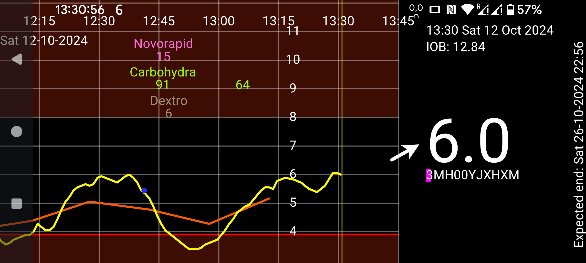

# Juggluco
Libre 2/2+/3/3+, Sibionics GS1, Dexcom G7/1+, Accu-Chek, CareSensAir, Aidex X

The motivation to write Juggluco was the need to use the sensor glucose values for something more than knowing my current glucose level or getting a global view the success of my glucose control.
I wanted to use the glucose curve to easily refer back to previous experiences and see exactly how it went in relation to insulin doses, carbohydrate intake and activities. A little isolated slowly generated curve in portrait mode doesn’t allow for that.
Juggluco is an app that receives glucose values via Bluetooth from Freestyle Libre 2, 2+, 3 and 3+, Sibionics GS1Sb, Dexcom G7/ONE+, Accu-Chek SmartGuide, CareSens Air and Aidex X sensors. In addition, Juggluco can scan NovoPen® 6 and NovoPen Echo® Plus and receive test results via Bluetooth from Contour Next glucose meters. 
Juggluco can send glucose values to all kinds of smartwatches, see left menu→Watch→Help: https://www.juggluco.nl/Jugglucohelp/watchinfo.html 
The phone version of Juggluco can talk out incoming glucose values, display it in a widget on the home screen and in floating glucose above other apps. Juggluco can display the usual glucose statistics. Other apps can receive data from Juggluco via glucose broadcasts and the web server in Juggluco. Juggluco can send data to Health Connect, Libreview and Nightscout. Data can also be exported to a file or send to another exemplar of Juggluco on another phone, tablet, emulator or watch. It has the option to set low and high glucose alarms and medication reminders.
<h4>Start</h4>To use a <b>Libre 2</b> sensor, scan it with Juggluco. To take over a <b>Libre 3</b> sensor from Abbott's Libre 3-only app, you need to enter in left menu→Settings→Exchange data→Libreview the same account as when activating the sensor and press <i>Get account ID</i>, to receive a number from Libreview. When you now scan the sensor this number will be sent to the sensor. No Libreview account is needed, when the Libre 3 sensor is activated with Juggluco: enter an arbitrary number before scanning the sensor. The first time it takes 2 to 10 minutes before Juggluco receives a glucose value via Bluetooth from the sensor. To prevent interference, force stop apps and turn off devices previously used with the sensor. To keep Juggluco running in the background, allow background activity and turn off battery optimizations for Juggluco. Don’t hide Juggluco’s notification. 
After scanning a Libre 2 sensor with Juggluco, Abbott’s Libre 2 app can only scan the sensor (when two apps are on the same phone they can both receive glucose values from European Libre 2 sensors, but this can give connection problems.) Libre 3 sensors can still be used with Abbott’s Libre 3 only app after using it with Juggluco: stop Juggluco and scan the sensor with Abbott’s Libre 3 app, agreeing that you stop the current sensor and start a new one. When going back to Juggluco you have to scan again. 
Scan with left menu→<i>Photo</i> the data matrix on the applicator for of <b>Dexcom G7/ONE+</b>, the package of <b>Sibionics GS1Sb</b> and <b>Aidex X</b> and the inner package of <b>CareSens Air</b>, and the blue cap of <b>Accu-Check SmartGuide</b> sensors. For the last enter the pin when asked. Warning: CareSens Air sensors can switch device only once. See: https://www.juggluco.nl/Juggluco/sensors
<h1>Wear OS</h1>The phone version of Juggluco scans the sensor and sends this data to the WearOS version of Juggluco. Bluetooth on both phone and watch needs to be turned on. For fast transmission, also WIFI. After initialization, you can switch on and off directly connecting the sensor with the watch, with left menu→Watch→Wear OS config→<i>Direct sensor-watch connection</i>. https://github.com/j-kaltes/Juggluco/wiki#wearos-watches collects information about how well different watches work with Juggluco. 
Wear OS version contains complications to display the glucose level on a watch face.

https://www.juggluco.nl/Jugglucohelp/introhelp.html

## BUILD Juggluco

First, run `setup.py` (linux).

Then run `git submodule update --init`.

You also need to add a `local.properties` file with this content:

```
sdk.dir=<Android SDK path>
cmake.dir=<cmake path>
```

For example:

```
sdk.dir=/home/jka/Android/Sdk
cmake.dir=/home/jka/Android/Sdk/cmake/4.1.1
```
